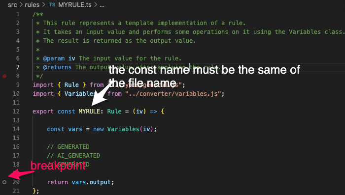
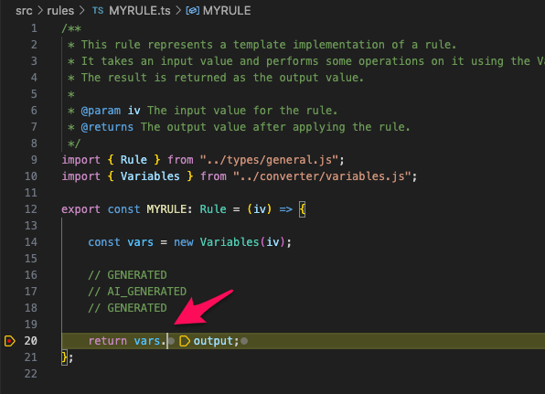

# Micro Executor Node Gibus

See [official docs](https://docs.smeup.cloud/en/CLS-SU/MURUNT/OPE/MURUNT_03/sdk-node) for all details.

## Development

```sh
git clone https://github.com/smeup/kokos-me-node-gibus.git
cd kokos-me-node-gibus
npm install
```

### Try a new rule

*The new rule will be named: MYRULE*

- Start debugger terminal: 
  - use this shortcut: ctrl+P and type: `>Debug: JavaScript Debug Terminal`
  - or click [command:extension.js-debug.createDebuggerTerminal](command:extension.js-debug.createDebuggerTerminal) if you are reading this doc in vscode
- Run micro executor
```sh
# linux osx
npm run dev

# win 
npm run dev:win
```

- Copy [TEMPLATES.ts](./src/rules/TEMPLATE.ts) into `./src/rules/MYRULE.ts`
- Replace:
```js
export const TEMPLATE: Rule = (iv) => { 
```
with rule id `MYRULE`:
```js
export const MYRULE: Rule = (iv) => { 
```
- Set a breakpoint

- Click on [http://localhost:8011/swagger/#/execution/ExecuteFun](http://localhost:8011/swagger/#/execution/ExecuteFun)
- Click on **Try it out**
- And past in the **Request body** this payload (where the property `k` of `obj1` contains your rule id: `MYRULE`)
```json
{
    "fun": {
        "component": "EXB",
        "service": "RULE",
        "function": "EXE.RUL",
        "obj1": {
            "t": "",
            "p": "",
            "k": "MYRULE"
        },
        "P": "",
        "INPUT": "{\"variables\": {\"§L_PORTANTE2\": 0 }}"
    },
    "context": {
        "user": {
            "sessionId": "string",
            "username": "string",
            "environment": "string",
            "device": "string"
        }
    }
}
```

If you are lucky you will see:   


and this **Response body**:
```json
{
  "type": "SmeupTable",
  "columns": [
    {
      "code": "NAME",
      "text": "Variable Name"
    },
    {
      "code": "VALUE",
      "text": "Variable Value"
    }
  ],
  "rows": [],
  "messages": [],
  "debugInfo": {
    "initialTimestamp": "2024-01-03T21:43:40.321Z",
    "finalTimestamp": "2024-01-03T21:47:41.002Z",
    "executionTime_ms": 240681
  }
}
```

## Converter

See [converter docs](./docs/converter.md) for all details.