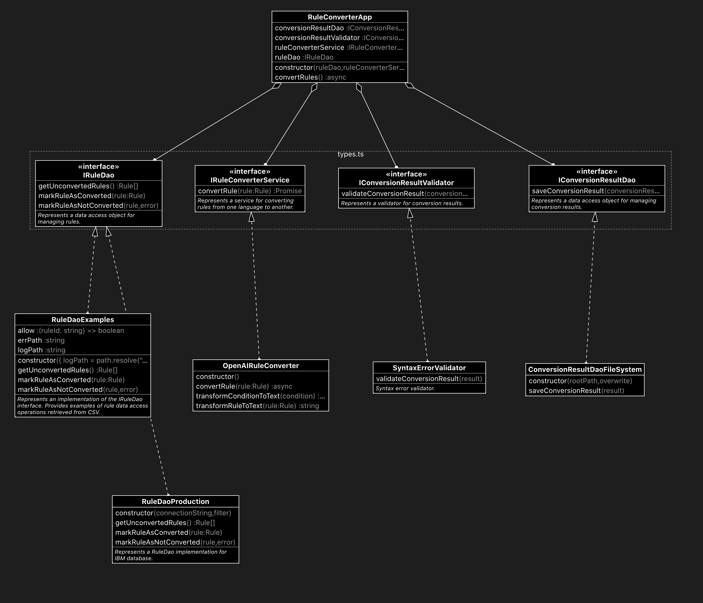

# Converter

## Rule conversion

### Test rule conversion

Before to convert the rules in production, it is possible to convert some example rules.  

Currently these rules are stored in [rules.tsv](../assets/test/rules.tsv) file.  
This file has been created by serializing the rules stored in `GIBUS_RULES` logical view placed in `srvlab01.smeup.com` schema `W_SMMB` retrieved with the following query:

```sql
select trim(COMP) AS COMP, PRGR, trim(REGO) as REGO, trim(IF_TRUE) as IF_TRUE, trim(IF_FALSE) as IF_FALSE 
from GIBUS_RULES where ASSI in ('ACCESSORI' , 'FT_GRO_INF_T01')
order by COMP, PRGR;
```

Further information about the pipeline can be found at [RuleConverterExampleApp](../src/converter/app.examples.ts) 

```sh
# linux osx
npm run convert-examples

# win
npm run convert-examples:win
```


### Convert rule in production

```sh
# linux osx
npm run convert-production

# win
npm run convert-production:win
```


## Development

### Modules
- [types](../src/converter/types.ts) - Contains all definitions
- [variables](../src/converter/variables.ts) - RuleVariableMap helper used to simplify the LLM prompt definition
- [prompts](../src/converter/prompts.ts) - Instruction used for the dsl to javascript conversion
- [app](../src/converter/app.ts) - The definition of RuleConverterApp that implements all steps needed for the conversion pipeline
- [rule-dao.examples](../src/converter/rule-dao.examples.ts) - The IRuleDao implementation that retrieves the rules from [rules.tsv](../assets/test/rules.tsv)
- [rule-dao.production](../src/converter/rule-dao.production.ts) - The IRuleDao implementation that retrieves the rules from `GIBUS_RULES` table
- [rule-converter.openai](../src/converter/rule-converter.openai.ts) - The IRuleConverterService that use OpenAI to convert the rules
- [conversion-result-validator](../src/converter/conversion-result-validator.ts) - The IConversionResultValidator implementation, that validates the syntax of the converted rules
- [conversion-result-dao.file](../src/converter/convertion-result-dao.file.ts) - The IConversionResultDao that save the rule converted in a file




