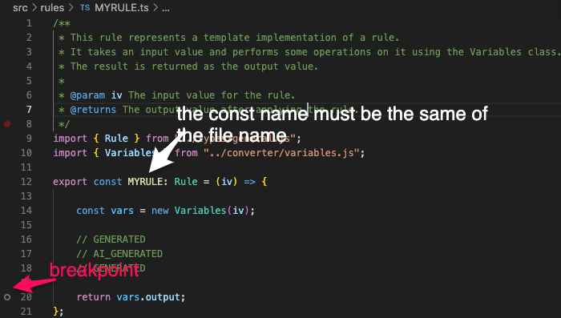
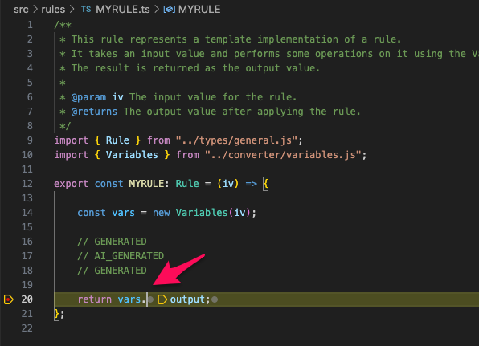

# Local development guide

## The rule service

This micro executor is a nodejs application that exposes a REST API to execute a rule.

The rule service is implemented in [RuleService](../src/services/RULE.ts) and every rule is implemented in a file placed in [rules](../src/rules) folder.

## The converter

Transpiles the rules written in a proprietary DSL into javascript.

See [Converter rule](./converter.md) for all details.


## Development

```sh
git clone https://github.com/smeup/kokos-me-node-gibus.git
cd kokos-me-node-gibus
npm install
```

### Write and test new rule

*Given a new rule named: MYRULE*

- Copy [TEMPLATES.ts](../src/rules/TEMPLATE.ts) into `../src/rules/MYRULE.ts`
- Replace:
```js
export const TEMPLATE: Rule = (iv) => { 
```
with rule id `MYRULE`:
```js
export const MYRULE: Rule = (iv) => { 
```

#### Create and run test unit
- Copy [TEMPLATES.test.ts](../test/rules/TEMPLATE.test.ts) into `../test/rules/MYRULE.test.ts`
- Replace `TEMPLATE with MYRULE`

- Run test
```sh
# linux osx
npm run test ../test/rules/MYRULE.test.ts

# win
npm run test:win ../test/rules/MYRULE.test.ts
```


#### Debug endpoint through swagger
- Start debugger terminal: 
  - use this shortcut: ctrl+P and type: `>Debug: JavaScript Debug Terminal`
  - or click [command:extension.js-debug.createDebuggerTerminal](command:extension.js-debug.createDebuggerTerminal) if you are reading this doc in vscode
- Run micro executor
```sh
# linux osx
npm run dev

# win 
npm run dev:win
```
- Set a breakpoint

- Click on [http://localhost:8011/swagger/#/execution/ExecuteFunV2](http://localhost:8011/swagger/#/execution/ExecuteFunV2)
- Click on **Try it out**
- And past in the **Request body** this payload (where the property `k` of `obj1` contains your rule id: `MYRULE`)
```json
{
    "fun": {
        "component": "EXB",
        "service": "RULE",
        "function": "EXE.RUL",
        "obj1": {
            "t": "",
            "p": "",
            "k": "MYRULE"
        },
        "P": "",
        "INPUT": "{\"variables\": {\"§L_PORTANTE2\": 0 }}"
    },
    "context": {
        "user": {
            "sessionId": "string",
            "username": "string",
            "environment": "string",
            "device": "string"
        }
    }
}
```

If everything is ok:


and this **Response body**:
```json
{
  "type": "SmeupTable",
  "columns": [
    {
      "code": "NAME",
      "text": "Variable Name"
    },
    {
      "code": "VALUE",
      "text": "Variable Value"
    }
  ],
  "rows": [],
  "messages": [],
  "debugInfo": {
    "initialTimestamp": "2024-01-03T21:43:40.321Z",
    "finalTimestamp": "2024-01-03T21:47:41.002Z",
    "executionTime_ms": 240681
  }
}
```
