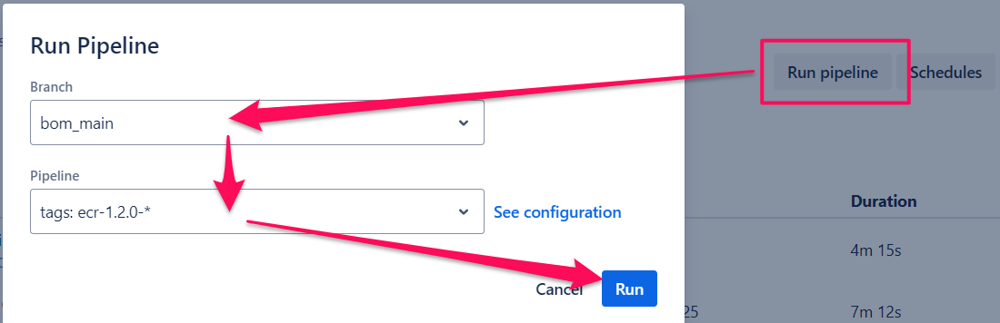

# Guida per lo sviluppo remoto

Lo sviluppo remoto consente di testare le modifiche *a caldo* sfruttando l'istanza **data-staging**.
Durante l'elaborazione delle distinte, l'AS400 si collegherà a questa istanza, rendendo possibile il test degli adeguamenti alle regole **prima** del loro passaggio sull'istanza **data** di produzione.

L’istanza **data-staging** sfrutta un pod di sviluppo, la cui immagine è stata etichettata come `"staging"`.

L'immagine è descritta nel file [Dockerfile.dev](../Dockerfile.dev).

## Modifica e test *a caldo* delle regole

Il branch di lavoro è `bom_main`.

Le modifiche vengono apportate utilizzando **OpenVSCode** su una cartella nella quale è possibile effettuare le seguenti operazioni:

* **pull**: consente di scaricare da Bitbucket la versione corrente di `bom_main`
* **push**: una volta testate le modifiche, questa operazione consente di trasferire le regole desiderate nella `bom_main`

## Deploy delle modifiche

Una volta testate e *pushate* le regole sulla `bom_main`, per effettuare il deploy in produzione è necessario attivare da Bitbucket la seguente pipeline:

## Pipelines

Le pipeline di Bitbucket consentono di aggiornare le immagini dei pod sia per **data** (istanza di produzione) sia per **data-staging** (istanza di test).
Sono definite nel file: [bitbucket-pipelines.yml](../bitbucket-pipelines.yml)

Sono state implementate in modo tale da richiedere sempre all’utente l’indicazione del branch da utilizzare per la creazione dell’immagine.

### `ecr-latest-*`

Questa pipeline crea un'immagine con tag `"latest"`.
*Attualmente non è utilizzata da alcun pod.*

### `ecr-1.2.0-*`

Questa pipeline crea un'immagine con tag `"1.2.0"`.
Attualmente è utilizzata dal pod dell'istanza **data** di produzione.

### `ecr-staging-*`

Questa pipeline crea un'immagine con tag `"staging"`.
Attualmente è utilizzata dal pod dell'istanza **data-staging**.
*La creazione di questa immagine è necessaria solo in caso di modifiche al file [Dockerfile.dev](../Dockerfile.dev).*

